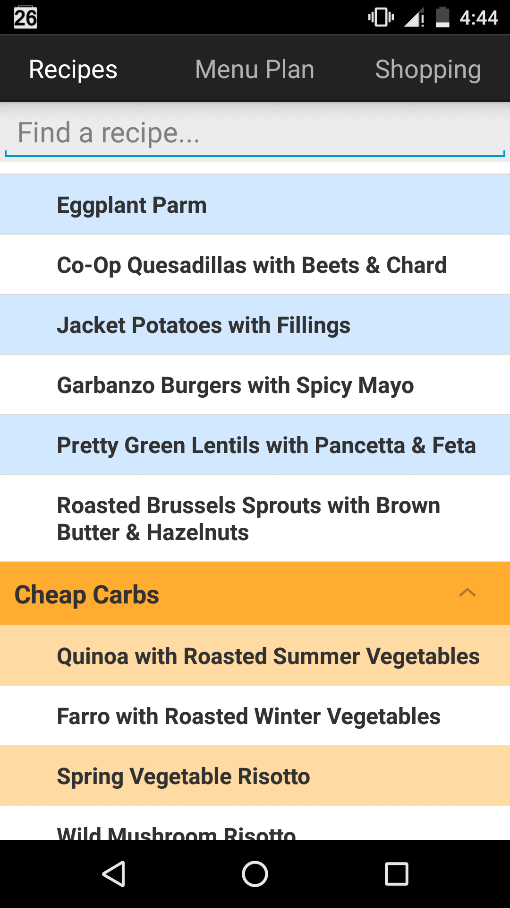
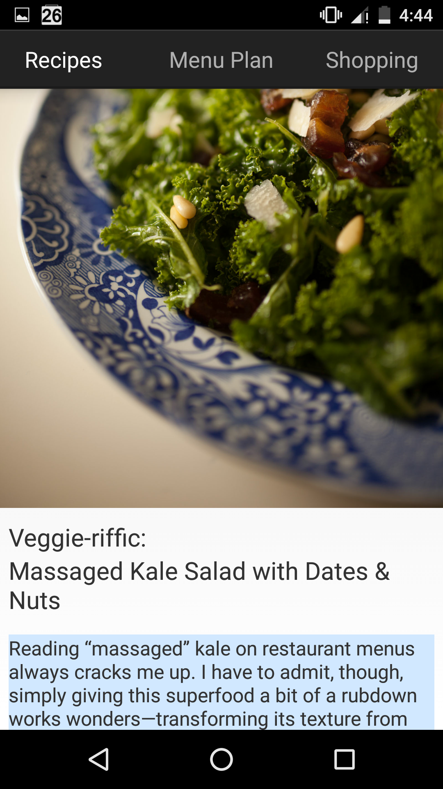
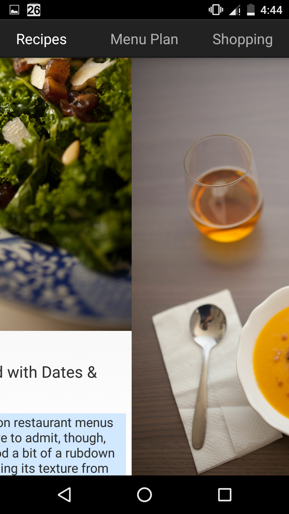
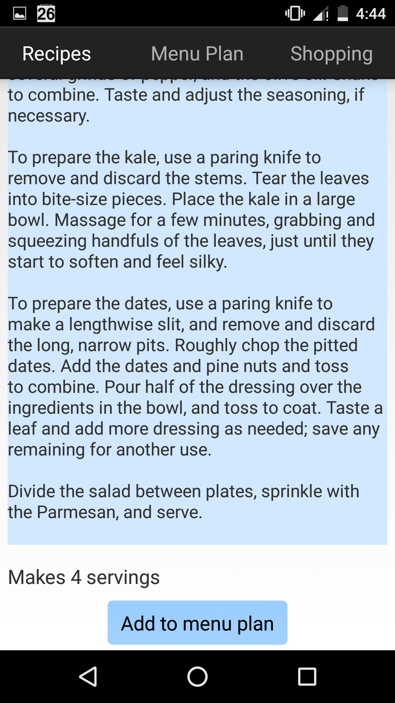
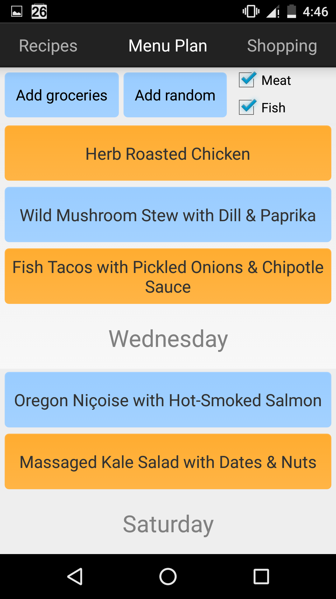
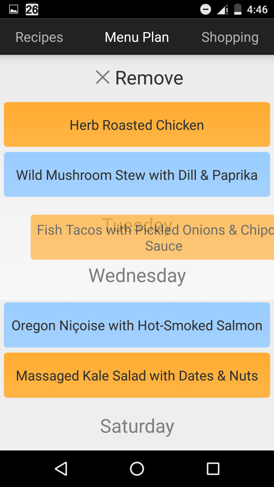
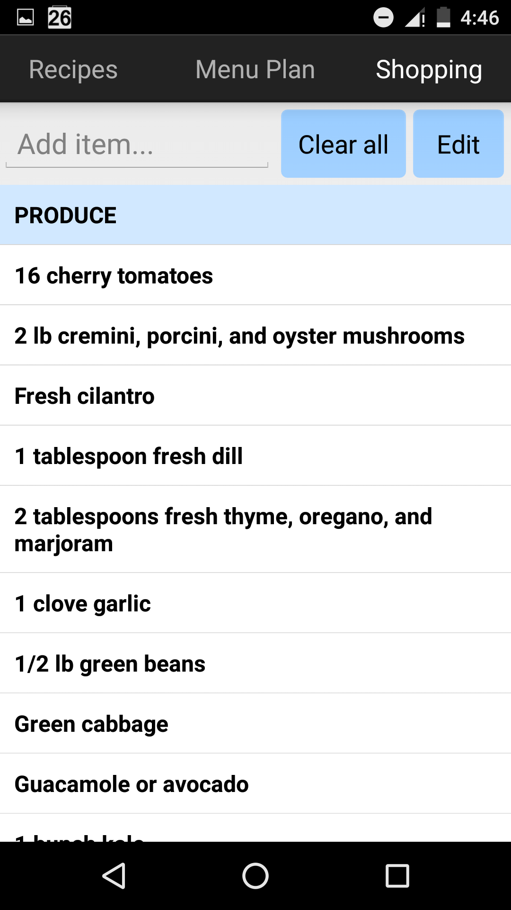
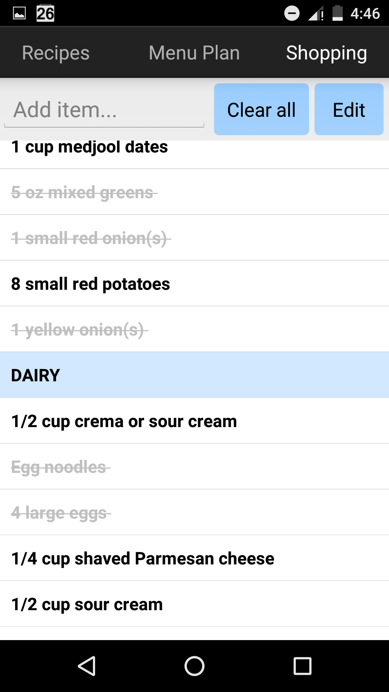

# how-to-feed-yourself

This is the code for an android app written to accompany the cookbook
[How to Feed Yourself: Recipes for Real Life from a Young & Hungry Foodie](https://www.amazon.com/How-Feed-Yourself-Recipes-Hungry/dp/0692332138).
I have included a small set of recipes and images along with the code.

## Features

* The recipe incredients and method are stored in a SQLite database allowing recipes to be easily added, deleted, or modified
* Recipes are organized by chapter and can be searched from the main screen. Multiple recipes can be quickly viewed by swiping
* A weekly menu plan can be built by adding recipes to a schedule. The menu plan can be edited by dragging and dropping recipe icons onto weekdays
* A grocery list for the menu plan is automatically generated, organized by item type, and with the same items combined and their quantities added
* The grocery list can be edited, and items can be added or removed. Clicking on items in the list crosses them out
* Tested on Nexus 5 phone

## Screenshots

