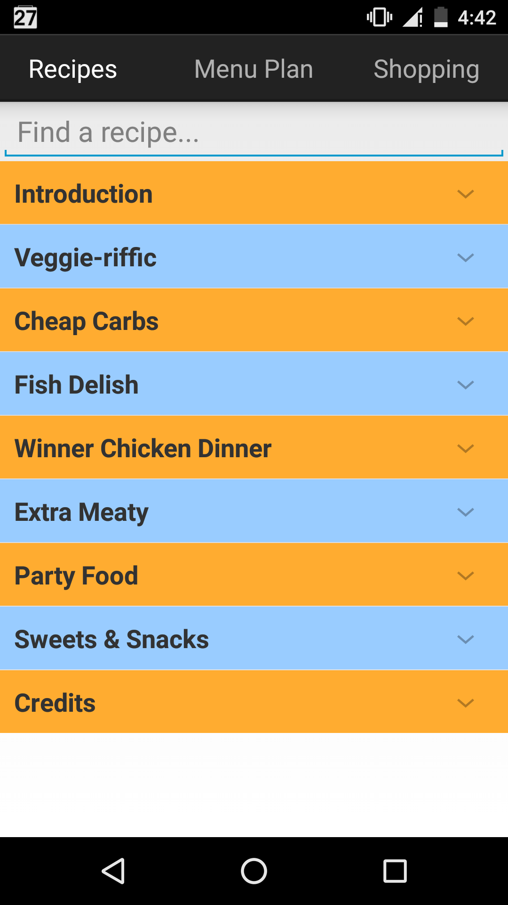

# how-to-feed-yourself

This is the code for an android app written to accompany the cookbook
[How to Feed Yourself: Recipes for Real Life from a Young & Hungry Foodie](https://www.amazon.com/How-Feed-Yourself-Recipes-Hungry/dp/0692332138).
I have included a small set of recipes and images along with the code.

## Features

<ul>
<li>The recipe incredients and method are stored in a SQLite database 
    allowing recipes to be easily added, deleted, or modified</li>
<li>Recipes are organized by chapter and can be searched from the 
    main screen. Multiple recipes can be quickly viewed by swiping</li>
<li>A weekly menu plan can be built by adding recipes to a schedule. The menu 
    plan can be edited by dragging and dropping recipe icons onto weekdays</li>
<li>A grocery list for the menu plan is automatically generated, organized by 
    item type, and with the same items combined and their quantities added</li>
<li>The grocery list can be edited, and items can be added or removed. 
    Clicking on items in the list crosses them out</li>
<li>Tested on Nexus 5 phone</li>

## Screenshots

